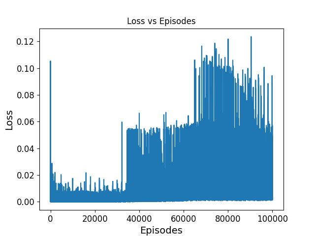

# Breakout

Um agente criado para jogar sobre o ambiente do famoso jogo de Atari: Breakout.

## Explicação

Para esse agente foi usado o módulo [TF Agents](https://www.tensorflow.org/agents) para implementar o algoritmo de DDQN, inspirado no livro [Hands-on Machine Learning](https://www.oreilly.com/library/view/hands-on-machine-learning/9781492032632/).

Portanto, o enviroment é criado a partir do módulo de TF Agents, mas isso não é um problema, ele usa o mesmo ambiente que o Arcade Legacy Enviroments, mas com uma dose de pré-processamento para agilizar o treinamento do agente.

## Funcionamento

Primeiro criamos a rede neural que será usada no algoritmo:

```
preprocessing_layer = keras.layers.Lambda(
                          lambda obs: tf.cast(obs, np.float32) / 255.)
conv_layer_params=[(32, (8, 8), 4), (64, (4, 4), 2), (64, (3, 3), 1)]
fc_layer_params=[512]

q_net = QNetwork(
    tf_env.observation_spec(),
    tf_env.action_spec(),
    preprocessing_layers=preprocessing_layer,
    conv_layer_params=conv_layer_params,
    fc_layer_params=fc_layer_params)
```

Esta rede consiste de apenas uma camada convolucional ligada a uma camada dense normal, a diferença é uma camada de pré-processamento antes que retira as três layers de cores e recorta apenas o necessário da imagem, garantindo menos pesos para a rede treinar e acelerando o treinamento inteiro.

Depois é criado o agente:

```
agent = DqnAgent(tf_env.time_step_spec(),
                 tf_env.action_spec(),
                 q_network=q_net,
                 optimizer=optimizer,
                 target_update_period=2000
                 td_errors_loss_fn=keras.losses.Huber(reduction="none"),
                 gamma=0.99, # discount factor
                 train_step_counter=train_step,
                 epsilon_greedy=lambda: epsilon_fn(train_step))
agent.initialize()
```

Que, como dito, utiliza o algoritmo de DDQN, atualizando a rede target a cada 2000 episódios.

Por último é criado um buffer de frames, o motivo para isso é porque de uma imagem estática não podemos remover features como velocidade, direção do movimento e nem aceleração.

```
replay_buffer = tf_uniform_replay_buffer.TFUniformReplayBuffer(
    data_spec=agent.collect_data_spec,
    batch_size=tf_env.batch_size,
    max_length=100000)

replay_buffer_observer = replay_buffer.add_batch
```

Por fim, o agente é treinado.

## Usagem

Para utilizar o script [Breakout.py](https://github.com/cemmanuelsr/deep-q-learning/blob/master/breakout/Breakout.py):

```
usage: Breakout [-h] [-t] [-m MODEL] [-g]

optional arguments:
  -h, --help            show this help message and exit
  -t, --train
  -m MODEL, --model MODEL
  -g, --gif
```

Onde `--train` deve ser passado caso deseje treinar e não visualizar um agente em ação. `--model` e `--gif` são referentes aos arquivos para salvar o modelo e um gif com a animação do agente em ação, respectivamente.

**OBS.:** a função de salvar um gif com a animação possui alguns bugs ainda desconhecido por esse desenvolvedor e será resolvida no futuro.

## Resultados

O gráfico de loss para o treinamento pode ser visto abaixo:



Podemos ver que o gráfico é condesado devido ao alto número de episódios, mas que o resultado é parecido com o [Lunar Lander](https://github.com/cemmanuelsr/deep-q-learning/tree/master/lunar-lander), ou seja, atinge um estado bom mas oscila muito.

No fim, o agente não consegue completar mais que uma ou duas dezenas de pontos. Para melhorar isso, pode ser feito testes com outras topologias de redes neurais, mas é preciso lembrar que quanto mais layers, mais pesos e mais demora no treinamento que já toma algumas horas.

No diretório de [logs](https://github.com/cemmanuelsr/deep-q-learning/tree/master/logs), pode ser visto o log do treinamento e verificar, a cada 1000 episódios, qual era a média de pontos do agente.
