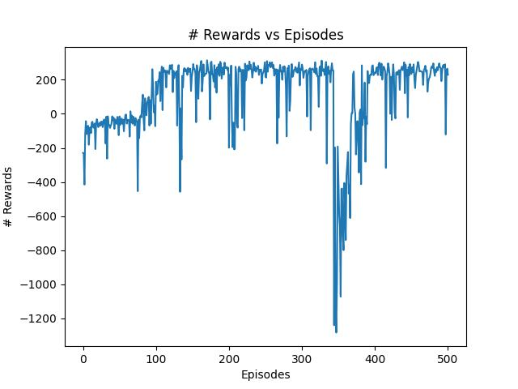
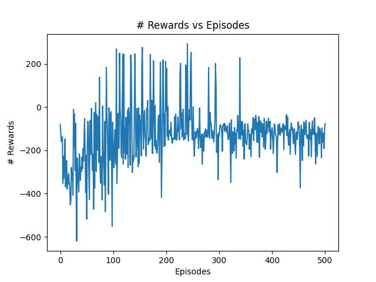

# Lunar Lander

Este é o agente criado sobre o ambiente do Lunar Lander. O objetivo do agente é pousar suavemente uma nave espacial entre duas bandeiras.

## Usagem

O script [LunarLander.py](https://github.com/cemmanuelsr/deep-q-learning/blob/master/lunar-lander/LunarLander.py) é responsável por treinar e testar um agente. Os parâmetros podem ser alterados a vontade no arquivo.

O script recebe os seguintes argumentos:

```
usage: LunarLander [-h] [-t] [-d] [-r RESULT] [-m MODEL]

optional arguments:
  -h, --help            show this help message and exit
  -t, --train
  -d, --double
  -r RESULT, --result RESULT
  -m MODEL, --model MODEL

```

Onde `--train` é passado se o objetivo for treinar o modelo e `--double` se desejarmos usar a abordagem de DDQN. `--result` e `--model` são referentes ao nome do arquivo com os resultados e com o modelo salvo, respectivamente.

## Resultados

Os resultados podem ser vistos abaixo:

<div style="display : flex; justify-content: space-around;">




</div>

A esquerda, utilizando a abordagem de DQN e a direita DDQN. Podemos ver que houve na verdade uma perda de desempenho, durante o treinamento foi possível observar que, por alguma razão esquisita, o agente fica flutuando um pouco acima da bandeira ou parado nas redondezas destas e isso deve justificar esse resultado.
